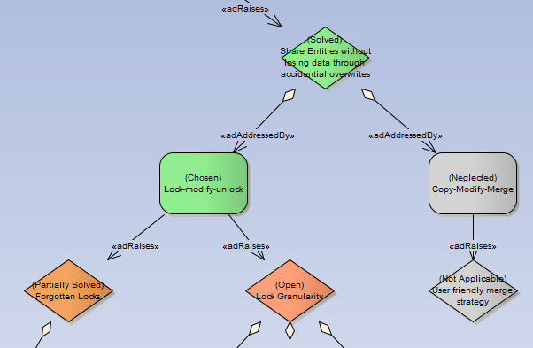

# AD Mentor

[AD Mentor](http://www.ifs.hsr.ch/ADMentor-Tool.13201.0.html) brings support for the AD modeling language for architectural decisions introduced in the IEEE/IFIP WICSA 2015 paper [Architectural Decision Guidance across Projects](http://www.ifs.hsr.ch/fileadmin/user_upload/customers/ifs.hsr.ch/Home/projekte/ADMentor-WICSA2015ubmissionv11nc.pdf).

AD is a modeling language designed to extract knowledge entities from past projects and reuse them as decision guidelines in future projects. A typical AD project starts with one or more existing _Problem Spaces_ provided by knowledge producers. Architects then derive a concrete _Solution Space_ enriched with custom decisions specific to the project and document the options that have been chosen to solve general and project-specific design problems.

The AD Mentor add-in includes a UML profile for the AD language and several tools that simplify working with Solution and Problem Spaces.

## Download

The current version of AD Mentor is available at [the release page](https://github.com/Luegg/ADMentor/releases).

## Documents

* [User Guide](userGuide.md)
* [Information for Contributors](contribute.md)
* [ADMentor Decision Model](docs/ADMentor.eap)
* [License](LICENSE)

## Acknowledgment

The research that lead to the development of ADMentor was supported by an ABB Research Grant 2014.

